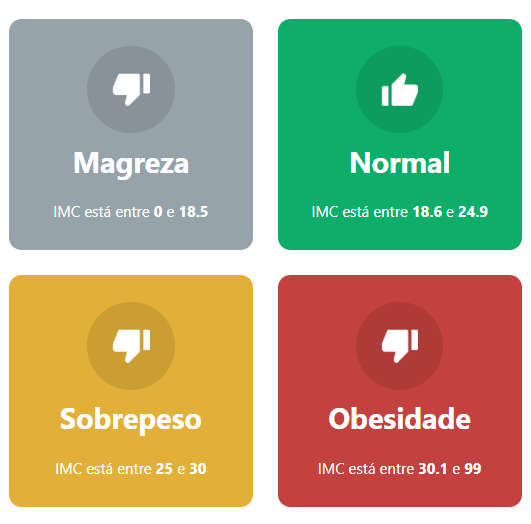

<p align="center">
  <a href="" rel="noopener">
 </a>
</p>

<h3 align="center">IMC React</h3>

<div align="center">

</div>

---

<p align="center"> Calculate your IMC in a fast way.
    <br> 
</p>


## 🧐 About <a name = "about"></a>

A project made with React + Typescript to calculate the IMC (body mass index) of a person. It calculates the height squared, then get the weight and divide by the height. Depending on the result it shows if you're a health person according to the WHO (World Health Organization). 

## 🏁 Getting Started <a name = "getting_started"></a>

There's no much to get started, just download or clone the project and follow the rules below:

### Prerequisites

You'll need to install npm

```
npm install -g npm
```

### Installing

After that clone the project or download ZIP, open the terminal in the project folder and then execute the following command:

```
npm i
```

And repeat

```
npm run dev
```

## 🚀 Deployment <a name = "deployment"></a>

Add additional notes about how to deploy this on a live system.

## ⛏️ Built Using <a name = "built_using"></a>

- [Typescript](https://www.typescriptlang.org/) - Development Language
- [React](https://reactjs.org/) - JS Library

## ✍️ Authors <a name = "authors"></a>

- [@brenosantin96](https://github.com/brenosantin96)

